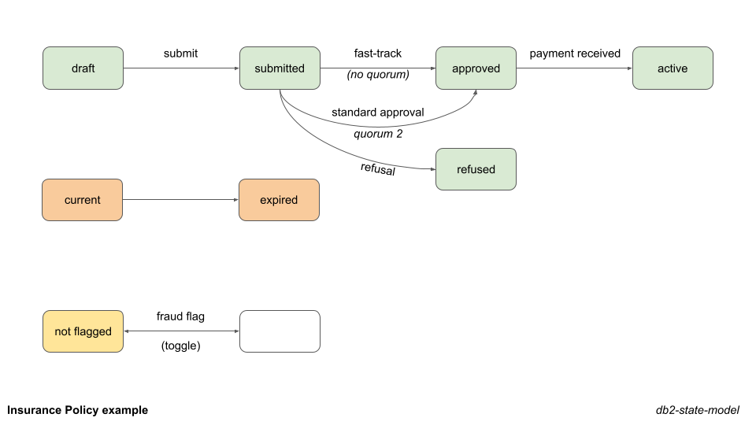

# db2-state-model

## Overview
An enterprise solution for managing object (aka entity) states as a service. Objects are associated with one or more state models, and state transitions managed in a controlled manner.

The solution is built with a Db2 for LUW schema. Its tables hold state model metadata, object states and transition history. SQL modules enable permitted user manipulation of this data. A Java tier (TBC) provides methods for integrating with applications.

## Rationale
In business systems there is a need to manage object states. In modern systems with service-orientated architectures, different services can be responsible for different state transitions. It is desirable that controls are in place.

Example use cases:
* You wish to capture and publish object lifecycle changes.
* You wish to block transitions that do not comply with state models. These might otherwise occur, for example due to inadequate controls in complex environments.
* You need to set up a new authorisation workflow.
* You wish to ensure that only authorised users or services can perform specific transitions.

## Features
Features of the solution include:
* Interlinking of state models - object state transitions can depend on the state of more than one model, and can change the state of more than one model
* Database design optimised for high volume, parallel activity
* Modular approach, supporting separation of duties
* Ability to separate ownership and access control of data belonging to different applications
* Ability to limit specific transitions to specific user roles, and which roles can view which data
* Subscriptions for object state transition listeners
* Quorum feature supporting authorisation workflows
* SQL and (TBC) Java API

## Status
Early draft, unsuitable for Production.

## Setup
See [Installation instructions](docs/INSTALL.md).

## Examples
* [Insurance Policy Example](docs/EXAMPLE.md)
* [Subscription Example](docs/SUBSCRIPTION_EXAMPLE.md)
